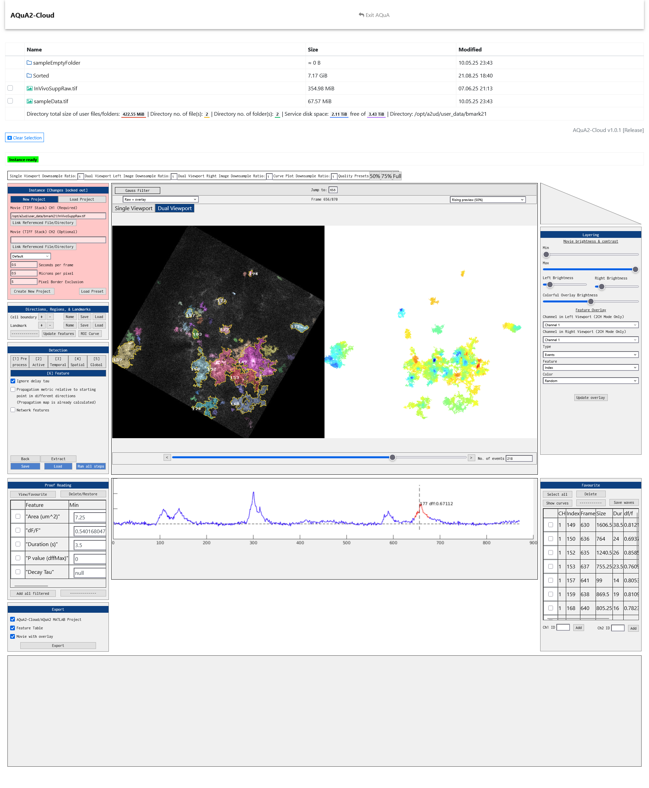

AQuA2-Cloud is a online version of AQuA2 that runs in a docker container with network connectivity and capability for remote usage of AQuA2 and its core features. It uses the [MATLAB version of AQuA2](https://github.com/yu-lab-vt/AQuA2) as a logical
back-end with custom-wrapper enabled forwarding of the GUI state. Multiple simulatenous users are supported.

It is intended to be deployed by groups, individuals, or institutions looking to enable networked multi-user conduct of spatiotemporal biological imaging analysis on a particular hardware system through a web interface.

AQuA2-Cloud supports all functionality of AQuA2 **except** for:
- CFU Analysis
- Viewing 3D data

If you need to use any of the above features, you'll want to run AQuA2 locally on your machine. However, data files and results generated by AQuA2-Cloud are **directly compatible** with AQuA2. Therefore, you can do core/bulk 2D data analysis using AQuA2-Cloud then download and load the data files in your local AQuA2 program and conduct CFU analysis if such late-stage analysis is required. For 3D data, you'll want to use the standalone MATLAB version of AQuA2.




## Public Service

We host a publicly available deployment of this service in our datacenter at Virginia Tech. You can access the service login page at https://yulab.vt.domains/AQuA2/

After creating an account, simply email one of the contacts listed in the resultant contact page to have your account activated. This is to protect our computational/storage resources from misuse. Sample data is provided for testing and evaluation.

## Basic Usage

A basic guide for getting started, which can be locally viewed in any web browser (click on the .html file after unpacking), can be downloaded here: (https://raw.githubusercontent.com/yu-lab-vt/AQuA2-Cloud/main/guide/AQuA2_cloud_guide.zip). 

This same guide is also provided as a navigable webpage when you login to any deployed instance of this system.

## AQuA2-Cloud Setup
**If you are simply updating your AQuA2-Cloud to the latest version, skip to step 4.**

This setup is to be conducted on the machine (the server) for which you'd like to run AQuA2-Cloud. Clients will only need a web-browser and FTP client later. For deploying AQuA2-Cloud, you will need Docker Engine.

Setup requires usage of a VNC client. We recommend RealVNC Viewer: ([www.realvnc.com/en/connect/download/viewer/](www.realvnc.com/en/connect/download/viewer/)). There are two options for manner of usage of the VNC client during setup...

**Option A:** Install a VNC Client on the server. This is valid if your server has remote desktop and a desktop environment for users.

**Option B:** Install a VNC Client on a LAN workstation, and allow connections from that workstation's IP address to the server, by specifying the workstation's IP address in the command line for the container's first time startup. You can connect to the internal display system of the docker container later for updating MATLAB license configurations.

>1. Install Docker Engine on host/server:
>
>      **Windows:** Download and install Docker Desktop ([www.docker.com/products/docker-desktop/](https://www.docker.com/products/docker-desktop/))
>
>      **Debian-based Linux:** Install docker engine via the command line interface (CLI). This code should work on most Debian-based linux distributions (Ubuntu, Linux Mint, Zorin, Kali, etc).
>
>      ```console
>      curl -fsSL https://get.docker.com -o get-docker.sh
>      sh get-docker.sh
>      ```
>
>      **or...** Simply install Docker Engine using your distro’s package manager.

>2. Depending on your choice for how to go about the VNC client usage, install a VNC client on the host/server or on a LAN workstation.

>3. Download this Github project and place the project folder somewhere on the host/server.
>
>      **Windows**: Use the web-browser to download the project and file explorer to place the folder wherever you like. Or, use git to do so as shown below...
>
>      **Linux**: 
>      
>      ```python
>      git clone https://github.com/yu-lab-vt/AQuA2-Cloud.git
>      cd AQuA2-Cloud
>      ```

>4. **Important:** AQuA2-Cloud uses MATLAB for the core application logic. You will need to download the **MATLAB linux installer .zip** and place it into the *matlab_installer* folder within the Github project folder. 
>
>     Go to https://www.mathworks.com/downloads and login via your mathworks account that contains a license of matlab, and download a recent release for **Linux**. It should download as a **.zip file with name similar to format of "matlab_Rxxxxx_Linux.zip"**.
>
>     Place it into the *matlab_installer* folder within the Github project folder

>5. Configure your instance prior to deployment by editing *containerSetupSettings.txt*
>
>      You should set a root password for your container. **Save this password in a safe place. You will need it for performing service management functions in the future as needed.**
>
>      The root password is set by changing *changeme* to a root password that you will use. Example: ROOT_PASS=mycustompassword
>      
>      You can also customize your server here, including changing ports, the information used in a generated SSL certificate (you can also add your own certificate to the docker volume later), and setting the contact information that is displayed in the website. 
>
>      Replace **127.0.0.1** value for parameter **CLOUD_SERVER_IP_DOMAIN** with the expected IP/Hostname of your server. For example, our publicly available deployed instance has (CLOUD_SERVER_IP_DOMAIN=yulab.vt.domains), a hostname.
>
>      If your container will be deployed on a machine connected to a LAN with a fixed IP address, you should use that fixed IP address as the value. For example, (CLOUD_SERVER_IP_DOMAIN=192.168.1.59).
>      
>      Below is an instructional guide and explanation for all of the parameters. The actual *containerSetupSettings.txt* won't contain any of the text enclosed by ( ).
>
>      ```
>      AUTOMATIC_SETUP=true (Don't change)
>      DEV_MODE=false (Leave disabled. If enabled, creates a testing user account with username testU and password testP)
>      ROOT_PASS=changeme (Change)
>      OPENSSH_SERVER_PORT=32 (The port to use for SSH connections)
>      MATLAB_FILES_SKIP=false (Leave false. Skips checking if a matlab installer .zip file is present. The .zip file is copied into the container during image build, and setup will fail without it.)
>      MYSQL_DATABASE_DIRECTORY="/mysql" (Leave as is. Determines the directory for MySQL database within the docker volume.)
>      CLOUD_SERVER_IP_DOMAIN=127.0.0.1 (Replace with the IP or domain name that you'd like the server to respond to.)
>      VSFTPD_SERVER_PORT=33 (The port that you'd like FTPS connections to be established on)
>      VSFTPD_SERVER_PSV_MIN_PORT=50000 (FTPS needs a range of ports to direct incoming connections to after handshake. This port is the begginning of the range.)
>      VSFTPD_SERVER_PSV_MAX_PORT=50009 (This port is the end of the range.)
>      SSL_COUNTRY="US" (The country listed on the auto generated SSL certificate. This must be only two letters.)
>      SSL_STATE="VA" (The two-letter state designator listed on the auto generated SSL certificate. This must be two letters.)
>      SSL_LOCALITY="City" (The city listed on the auto generated SSL certificate.)
>      SSL_ORG="Organization" (The organization listed on the auto generated SSL certificate.)
>      APACHE_LOG_DIR="/apache_server_logs" (Where to save logs generated by the web server)
>      CONTACTPERSON1NAME="person1name"
>      CONTACTPERSON1INFO="person1info"
>      CONTACTPERSON1EMAIL="person1email"
>      CONTACTPERSON2NAME="person2name"
>      CONTACTPERSON2INFO="person2info"
>      CONTACTPERSON2EMAIL="person2email
>      CONTACTPERSON3NAME="person3name"
>      CONTACTPERSON3INFO="person3info"
>      CONTACTPERSON3EMAIL="person3email"
>      CREATE_GUEST_ACCOUNTS=false (If enabled, generate 5 guest accounts with names "guest1" through "guest5". Each account has a unique generated password, and passwords are saved in *guest_accounts.txt* in the docker volume.)
>      ```

>6. **Make sure you did steps 4 and 5 first.** Create the AQuA2-Cloud image.
>
>      First, navigate to the project folder in an administrative/root terminal if you haven't already done so. Then, run:
>
>      ```python
>      docker build -t aqua2-cloud .
>      ```

>7. Modify the following command as needed to properly configure your container. 
>
>     Ensure ports defined are correct (example: if you changed SSH port from 32 to 42 in step 5, change 32:32 to 42:42 in the command below). 
>
>     You can define the CPU count and the allocated RAM for the deployed service here. Note that there is a generally a minimum RAM requirement of about 10-12 GB for stable and reliable operation. Generally, the more CPU and RAM allocated, the faster the processing.
>
>     If you elected for option B for how to go about using the VNC client, change the IP address for the VNC port mapping to the IP address of your LAN workstation (i.e. change 127.0.0.1:5900:5900 to xxx.xxx.xxx.xxx:5900:5900 where xxx.xxx.xxx.xxx is the LAN workstation address). Running this command will use the AQuA2-Cloud image created in step 6 to automatically create a container, create a docker volume (if it doesn't already exist) for storing user data, and to deploy the service. The container by default uses port 32 for local host-to-container SSH connections. You can always delete the container (**don't delete the docker volume unless you want to delete all user data and databases as well**), download the latest github project folder, rebuild the image, and deploy a new container to update AQuA2-Cloud to to the latest version without losing any user data (files or website accounts) as it will use the existing docker volume.
>
>      ```python
>      docker run --cpus="24" --memory="64G" -it --restart=unless-stopped -p 127.0.0.1:32:32 -p 80:80 -p 127.0.0.1:5900:5900 -p 443:443 -p 33:33 -p 50000-50009:50000-50009 -v aqua2-cloud-data:/opt/a2ud --tmpfs /mnt/matlab_ramdisk:rw,exec,size=8g --name aqua2-cloud-container aqua2-cloud
>      ```

>8. Follow the instructions given by the container during first time setup. You will need to connect to the container via the VNC client to interactively login to MATLAB and select the toolboxes required by AQuA2-Cloud. **You will have to login to MATLAB a total of 2 times.** If you run the VNC client on the hosting machine the connection address will be 127.0.0.1:5900, otherwise, you may have to allow access to port 5900 over LAN in order to connect to the container on the server.

>9. Setup any specific firewall rules you might need. All ports utilized by the service are shown in the command line in step 7, so whatever the port numbers are, those will be the port numbers you should inspect your server's firewall configuration for.

## MATLAB License Renewal, Issues, or Changes

There are two options for licensing management.

1. Follow the **Start the MATLAB licensing utility** in the **Service management functions within the container** section below.
2. Delete and redeploy the container. User data and databases persist between deployments (provided you don't delete the AQuA2-Cloud docker volume). Use VNC client to follow the setup process again, which will include logging into a mathworks account with a valid license.

## Cloud service management

<table>
<tr><td style="background-color:#f0f8ff; padding:10px; border-radius:8px;">

### Service management functions on the container host

The following terminal commands should work in a terminal for both Linux and Windows container hosts.

### List running docker containers
```
docker ps
```

### List all containers
```
docker ps -a
```

### List volumes
```
docker volume ls
```

### Stop running container
```
docker stop [container_name_or_id]
```

### Delete container
You can use this command to delete the AQuA2-Cloud container while preserving user data and accounts, as it does not delete the docker volume that the container uses.

Deployment of a new AQuA2-Cloud container will result in the new container automatically detecting and using any existing AQuA2-Cloud volume and database.
```
docker rm [container_name_or_id]
```

### Delete volume
**This will delete user data if you delete the AQuA2-Cloud volume.**
```
docker volume rm VOLUME_NAME [VOLUME_NAME]
```

### SSH to the container

```
ssh -p 52 root@localhost
```
Replace 52 with your custom defined SSH port value if you modified it during setup.
Enter the root password of the docker container when prompted.

</td></tr> </table>

<table>
<tr><td style="background-color:#D3E3C8; padding:10px; border-radius:8px;">

### Service management functions within the container
**For all service managment commands/functions shown below, replace <root_password> with the container root password where applicable, or enter root password when asked.**

### List users
```
mysql -u root -p
Use AQuA2_Cloud_Database;
SELECT * FROM users;
exit
```

### Verify user
This allows one to proceed past the "Verification required" page after initial account creation
```
/usr/local/bin/verify_user.sh <root_password> <the_user_username>
```
### Remove user
Deletes a user's account from the internal database system, but retains their user data.
```
/usr/local/bin/remove_user.sh <root_password> <the_user_username>
```
### Delete a user's data (Be careful)

List user folders first and check for the user data you're looking into deleting...
```
ls /opt/a2ud/user_data
```

You can delete a users data by replacing <the_user_username> with the username of the user
```
sudo rm -rf /opt/a2ud/user_data/<the_user_name>
```

### Change user password
Change a user's password. Rather than an integrated password reset system using emails, it is simpler to use a temporary password then have the user change it after logging in.
```
/usr/local/bin/change_user_password.sh <root_password> <the_user_username> <their_new_password>
```

### View website logs

Uses nano editor. (Left ctrl + x) to exit.

Press (Left alt + /) to go to end of file.

<u>Apache access log</u>
```
nano /opt/a2ud/apache_server_logs/access.log
```

<u>Apache error log</u>
```
nano /opt/a2ud/apache_server_logs/error.log
```

### View AQuA2-Cloud/MATLAB instance logs

Uses nano editor. (Left ctrl + x) to exit.

Press (Left alt + /) to go to end of file.

<u>List logs</u>
```
ls /opt/a2ud/aqua2_matlab_instance_logs
```

<u>View an instance log</u>
```
nano /opt/a2ud/aqua2_matlab_instance_logs/[log_file_name]
```

### Start the MATLAB licensing utility
```
ping -c 3 licensing.mathworks.com
```
Check that you get a response from above command before proceeding.
```
ls /mnt/matlab_ramdisk/
```
Use the above command to find the name of the folder containg the MATLAB install files. We are looking for a folder with the year/release name of MATLAB you're using. (For example, the above command returned "R2024b")

Replace **[REPLACE_ME_VERSION]** with the year/version of MATLAB that you're using. An example would be that for R2024b, the command becomes **/mnt/matlab_ramdisk/R2024b/bin/matlab -desktop**

```
/mnt/matlab_ramdisk/[REPLACE_ME_VERSION]/bin/matlab -desktop
```

After running the command, connect to the container via a VNC client to interact with the MATLAB licensing UI

### Check the graphical internal rendering system

Upon container creation and upon every container startup, the internal rendering system should automatically start as well. A periodic loop should also ensure it is running.

Check if internal rendering is active. Will return "Rendering system active" if Xvfb, fluxbox, and x11vnc within the container are all running, otherwise, will return "Rendering system not running"
```
pgrep -x Xvfb >/dev/null && pgrep -x fluxbox >/dev/null && pgrep -x x11vnc >/dev/null && echo "Rendering system active" || echo "Rendering system not running"
```

If for some reason it is not, the below command should start it.
```
export DISPLAY=:99; pgrep -x Xvfb >/dev/null || Xvfb :99 -screen 0 1280x1024x24 & pgrep -x fluxbox >/dev/null || fluxbox & pgrep -x x11vnc >/dev/null || x11vnc -display :99 -rfbport 5900 -forever -shared -nopw -listen 0.0.0.0 &
```

If this fixes any issues regarding AQuA2-Cloud instances hanging at "Initializing backend logic", please submit a bug report containing the circumstances of your deployment and usage.

## Website SSL certificate

An auto-generated certificate that is self-signed is used for the website and FTPS server. It is located at /opt/a2ud/aqua2_cloud_ssl_certificate in the container.

If you want to host this service in a publicly accessible manner, you'll want to have your certificate signed by a certificate authority. This will remove the exclamation mark on the padlock next to the url bar when users access the website in a web browser.

Use the following commands to get a signed certificate. Replace <CLOUD_SERVER_IP_DOMAIN> with your IP or domain.

```
service apache2 stop
certbot certonly --standalone -d <CLOUD_SERVER_IP_DOMAIN>
cp /etc/letsencrypt/live/<CLOUD_SERVER_IP_DOMAIN>/fullchain.pem /opt/a2ud/aqua2_cloud_ssl_certificate/aqua2_cloud_certificate.crt
cp /etc/letsencrypt/live/<CLOUD_SERVER_IP_DOMAIN>/privkey.pem /opt/a2ud/aqua2_cloud_ssl_certificate/aqua2_cloud_certificate.key
service apache2 start
```

This certificate is good for 3 months. After which, you'll have to run this command set again.

</td></tr> </table>

### FAQ

>#### "When users try to start an AQuA2-Cloud instance, the startup process gets stuck on 'Initializing backend logic'"
>There are several things that can cause this:
>1. Something changed with the MATLAB licensing within the container, or it is no longer valid. Try the **Start the MATLAB licensing utility** management section and see if the licensing needs to be corrected.
>2. The container's internal CPU-based graphical rendering system is not running. Reference the **Check the graphical internal rendering system** management section and see if this resolves the issue.
>
>In other cases, you can **View AQuA2-Cloud/MATLAB instance logs** to potentially find what the issue might be and to collect information for a bug report.